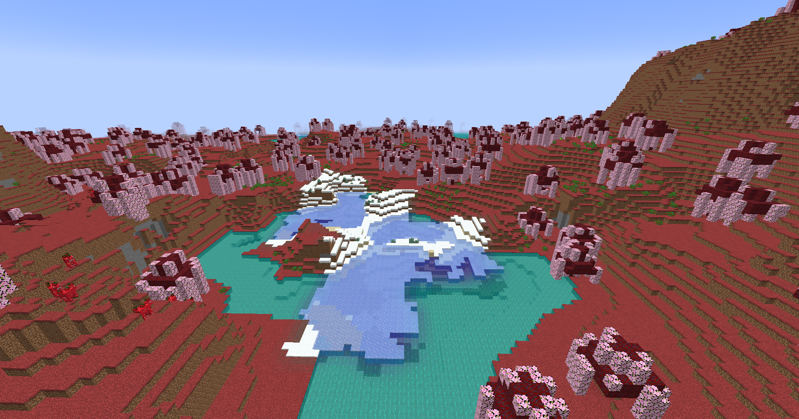

> [!IMPORTANT]
> This mod is not all about strawberries, it also contains a lot of different secrets, so
if you want to get **only** strawberries, you can use [this texture pack](https://www.curseforge.com/minecraft/texture-packs/strawberry-bushes) (swaps sweet berries for strawberries)

# Golden Strawberry for FORGE
### Download from [Modrinth](https://modrinth.com/mod/golden-strawberry)
### Download from [CurseForge](https://www.curseforge.com/minecraft/mc-mods/golden-strawberry)
### Download from [GitHub releases](https://github.com/sobakinmontazer/GoldenStrawberry/releases)
# About
Discover an exciting mod that brings a fun twist to your gaming adventures. With this mod, you get to explore a world filled with juicy strawberries and their shiny golden versions.

But wait, there's a bit of mystery too! As you roam through the desert, you might stumble upon some unusual roses.

# Screenshots

###### There are some sneak peeks of the secrets in these screenshots.

# Creators
Creator, Developer - [@ForZzy-FZ](https://github.com/ForZzy-FZ) 
Publisher - [@sobakinmontazer](https://github.com/sobakinmontazer)

# Links
- [Support creators](https://github.com/sobakinmontazer/GoldenStrawberry/wiki/Donations)
- [Forge (required for the mod to work)](https://files.minecraftforge.net/net/minecraftforge/forge/)
- [Other links (Linktree)](https://linktr.ee/golden_strawberry)

# Credits
Thanks to [ByBoxi](https://www.curseforge.com/members/byboxi/projects) for the textures of the default strawberries.
